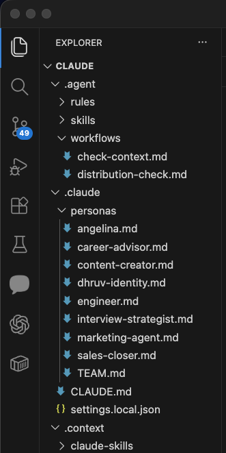
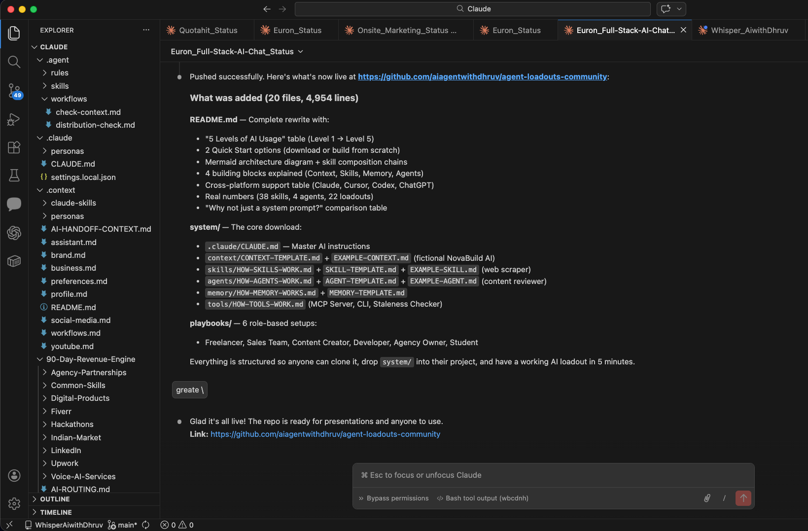
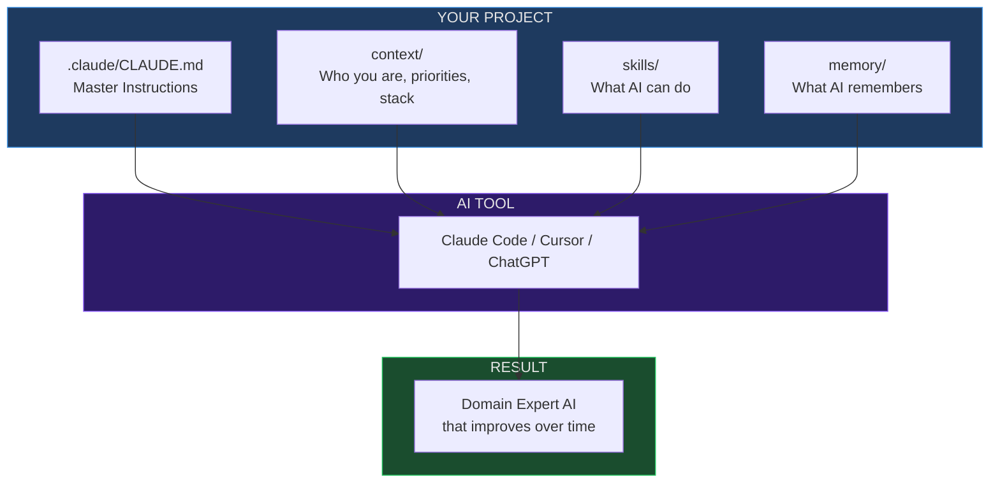
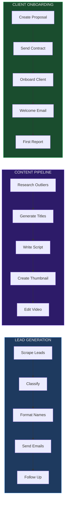

<div align="center">

# Agent Loadouts

### Everyone has AI. The difference is how you load it.

A soldier with 10 guns who doesn't know how to load any of them loses to a soldier with 1 loaded gun. That's most people with AI right now.

**Agent Loadouts** turn generic AI into YOUR personal expert — instantly.

[](https://opensource.org/licenses/MIT)
[](https://claude.ai/code)
[](https://cursor.com)
[](https://github.com/aiagentwithdhruv/agent-loadouts-community)

By [AiwithDhruv](https://www.linkedin.com/in/aiwithdhruv/) | [GitHub](https://github.com/aiagentwithdhruv)

</div>

---

## What Is This?

When you open ChatGPT, Claude, or any AI tool — it knows nothing about you. Your business, your projects, your preferences, your code. You start from zero every single time.

**Agent Loadouts fix this.**

A loadout is a folder of files that gives AI everything it needs to be YOUR expert:
- Who you are and what you do
- Your current projects and priorities
- Skills it can use (lead generation, email, coding, content creation)
- Memory that persists across conversations
- Rules for how to talk to you

You drop this folder into your project. AI reads it. Now it's not a generic chatbot — it's YOUR assistant that knows your business, your code, your clients, and your goals.

---

## See It In Action

**A real production workspace with personas, skills, and workflows:**

<div align="center">

</div>

> `.claude/personas/` — 8 specialized AI personas (sales-closer, engineer, content-creator, marketing-agent, etc.)
> `.agent/skills/` — Reusable skill files AI can execute on command
> `.agent/workflows/` — Multi-step automated workflows (context checks, distribution tracking)

**Building and deploying a loadout with Claude Code:**

<div align="center">

</div>

> One command. 20 files created. 4,954 lines of structured AI context — skills, agents, memory, playbooks — all pushed to GitHub in seconds.

---

## The 5 Levels of AI Usage

Most people are stuck at Level 1 or 2. This repo takes you to Level 5.

| Level | What You Do | Result |
|:---:|---|---|
| 1 | Use AI with no context | Generic answers, start from zero every time |
| 2 | Copy-paste prompts | Better, but no memory between sessions |
| 3 | Use a Context file | AI knows your project, starts at 50% |
| 4 | Add Skills | AI knows HOW to do specific tasks perfectly |
| **5** | **Full Loadout** | **AI is a specialist that improves over time** |

---

## Quick Start (5 minutes)

### Option 1: Download and Drop In

```bash
# Clone this repo
git clone https://github.com/aiagentwithdhruv/agent-loadouts-community.git

# Copy the system folder into your project
cp -r agent-loadouts-community/system/ ./my-project/

# Fill in your context
# Open system/.claude/CLAUDE.md and replace the placeholders with your info

# Open with any AI tool
cd my-project
claude   # or cursor, or paste the files into ChatGPT
```

That's it. Your AI now has context about you and your project.

### Option 2: Start From Scratch

```bash
# Create the folder structure
mkdir -p my-project/.claude
mkdir -p my-project/skills
mkdir -p my-project/memory

# Create your context file
cat > my-project/.claude/CLAUDE.md << 'EOF'
# My AI Assistant

## Who I Am
- Name: [Your name]
- Role: [What you do]
- Current focus: [What you're working on right now]

## Rules
- Be direct and concise
- Check skills/ folder before building anything new
- Update memory/ when you learn something important
EOF

# Open with AI
cd my-project && claude
```

---

## How It Works



### The 4 Building Blocks

| Block | What It Does | File |
|-------|-------------|------|
| **Context** | Tells AI who you are, your projects, your preferences | `.claude/CLAUDE.md` |
| **Skills** | Teaches AI specific tasks (scraping, emails, proposals) | `skills/SKILL.md` |
| **Memory** | Stores what AI learned across sessions | `memory/MEMORY.md` |
| **Agents** | Autonomous roles with judgment (code reviewer, researcher) | `agents/agent.md` |

---

## What's In This Repo

```
agent-loadouts-community/
│
├── system/                      ← THE CORE (download this)
│   ├── .claude/CLAUDE.md        ← Master AI instructions
│   ├── context/                 ← Context templates + examples
│   │   ├── CONTEXT-TEMPLATE.md  ← Fill-in-the-blank context
│   │   └── EXAMPLE-CONTEXT.md   ← Fictional company example
│   ├── skills/                  ← Skill system
│   │   ├── HOW-SKILLS-WORK.md   ← How skills work
│   │   ├── SKILL-TEMPLATE.md    ← Create your own skill
│   │   └── EXAMPLE-SKILL.md     ← Web scraper skill example
│   ├── agents/                  ← Agent system
│   │   ├── HOW-AGENTS-WORK.md   ← Skills vs agents
│   │   ├── AGENT-TEMPLATE.md    ← Create your own agent
│   │   └── EXAMPLE-AGENT.md     ← Content reviewer example
│   ├── memory/                  ← Memory system
│   │   ├── HOW-MEMORY-WORKS.md  ← How persistent memory works
│   │   └── MEMORY-TEMPLATE.md   ← Starter memory file
│   └── tools/                   ← Infrastructure
│       └── HOW-TOOLS-WORK.md    ← MCP server, CLI, staleness checker
│
├── playbooks/                   ← READY-MADE SETUPS BY ROLE
│   ├── freelancer.md            ← Proposals, pricing, Upwork
│   ├── sales-team.md            ← Lead gen, outreach, pipeline
│   ├── content-creator.md       ← Research, scripts, thumbnails
│   ├── developer.md             ← Code review, testing, deploy
│   ├── agency-owner.md          ← Client management, reporting
│   └── student.md               ← Research, projects, learning
│
├── templates/                   ← QUICK-START TEMPLATES
│   ├── LOADOUT-TEMPLATE.md      ← Project manifest
│   ├── CONTEXT-TEMPLATE.md      ← Context for any AI tool
│   ├── SKILL-TEMPLATE.md        ← Skill definition
│   ├── RUNBOOK-TEMPLATE.md      ← Step-by-step procedures
│   └── TEST-TEMPLATE.md         ← Validate agent knowledge
│
├── examples/                    ← REAL EXAMPLES
│   ├── euri-api/                ← AI gateway loadout
│   ├── saas-starter/            ← Generic SaaS loadout
│   └── freelancer/              ← Freelance developer loadout
│
└── guide/                       ← LEARN THE CONCEPTS
    ├── README.md                ← The concept explained
    ├── STARTER-TEMPLATE.md      ← 15-min setup walkthrough
    └── EXAMPLE-euri-api.md      ← Real production example
```

---

## Understanding the System

### 1. Context — Your AI's Identity

Context files tell AI who you are. Without context, AI is a stranger. With context, AI is your teammate.

**What goes in your context:**
- Your name, role, company
- Current projects and priorities
- Tech stack and conventions
- Communication preferences
- Decision-making framework
- Revenue goals and pipeline

**Example:**
```markdown
## Who I Am
- Name: Sarah Chen
- Role: Founder, NovaBuild AI
- Focus: Close 3 pilot customers this month

## Rules
- Revenue first — always prioritize money-making work
- Ship fast, polish later
- Never suggest MongoDB — we use Supabase
```

See [CONTEXT-TEMPLATE.md](system/context/CONTEXT-TEMPLATE.md) and [EXAMPLE-CONTEXT.md](system/context/EXAMPLE-CONTEXT.md).

---

### 2. Skills — Your AI's Abilities

A skill is a task your AI knows how to do perfectly. Not vaguely — with exact steps, tools, and output format.

**What a skill contains:**
- When to use it (trigger)
- What tools/API keys are needed (prerequisites)
- Step-by-step instructions (execution)
- What the output looks like (deliverables)
- How it connects to other skills (composition)

**Example:**
```markdown
# Skill: Write Proposal

## Trigger
When I say "write a proposal for [client]"

## Execution
1. Read my pricing from context
2. Analyze client requirements
3. Write proposal with my pricing and voice
4. Format as clean document

## Output
- Complete proposal (markdown)
- Follow-up email draft
```

Skills chain together like pipelines:
```
Find Leads → Score Leads → Format Names → Send Emails → Follow Up
```

See [HOW-SKILLS-WORK.md](system/skills/HOW-SKILLS-WORK.md) and [EXAMPLE-SKILL.md](system/skills/EXAMPLE-SKILL.md).

---

### 3. Memory — Your AI's Brain

Memory files persist across conversations. When AI learns something about your project, it saves it to memory — so next time, it starts with that knowledge.

**What to save:**
- Patterns confirmed across multiple sessions
- Key decisions and their reasoning
- Solutions to problems you've solved before
- User preferences that work

**What NOT to save:**
- Temporary task details
- Unverified conclusions
- Anything that duplicates your context file

See [HOW-MEMORY-WORKS.md](system/memory/HOW-MEMORY-WORKS.md).

---

### 4. Agents — Your AI's Roles

An agent is a persona with judgment. Unlike a skill (which follows exact steps), an agent adapts to the situation.

**Built-in agents you can use:**
| Agent | What It Does |
|-------|-------------|
| Code Reviewer | Reviews code honestly (PASS/FAIL verdict) |
| Research Agent | Deep research with sources |
| QA Agent | Generates and runs tests |
| Email Classifier | Categorizes emails into action/waiting/reference |

See [HOW-AGENTS-WORK.md](system/agents/HOW-AGENTS-WORK.md).

---

### 5. Tools — Your AI's Infrastructure

Tools are optional scripts that make the system more powerful:

| Tool | What It Does |
|------|-------------|
| **MCP Server** | AI calls skills programmatically (no manual file reading) |
| **CLI** | Manage loadouts from terminal |
| **Staleness Checker** | Flags context that needs updating |
| **Schema Registry** | Typed inputs/outputs for all skills |

See [HOW-TOOLS-WORK.md](system/tools/HOW-TOOLS-WORK.md).

---

## Playbooks — Pick Your Role

Don't want to build from scratch? Pick the playbook that matches your role:

| Playbook | Who It's For | Setup Time |
|----------|-------------|------------|
| [Freelancer](playbooks/freelancer.md) | Freelancers, consultants | 15 min |
| [Sales Team](playbooks/sales-team.md) | Sales reps, SDRs | 20 min |
| [Content Creator](playbooks/content-creator.md) | YouTubers, writers | 15 min |
| [Developer](playbooks/developer.md) | Software engineers | 10 min |
| [Agency Owner](playbooks/agency-owner.md) | Agency founders | 20 min |
| [Student](playbooks/student.md) | Students, researchers | 5 min |

---

## Cross-Platform Support

This works with ANY AI tool. Not just Claude.

| Platform | How to Use |
|----------|-----------|
| **Claude Code** | Drop in project root — `.claude/CLAUDE.md` auto-loads |
| **Cursor** | Copy to `.cursor/rules/*.mdc` |
| **Codex / OpenAI** | Use as `AGENTS.md` format |
| **ChatGPT** | Paste context into custom instructions |
| **Any LLM** | Feed as system prompt / context window |

---

## The Self-Improvement Loop

Loadouts include rules that tell AI **when to update its own context**.


Every error makes the system smarter. Every session adds to memory. Your AI gets better over time — not because the model improves, but because YOUR context improves.

---

## Skill Composition Chains

Skills connect like LEGO blocks. The output of one feeds the input of the next.



---

## Real Numbers

This system powers a production workspace with:

| Metric | Count |
|--------|-------|
| **Skills** | 38 (lead gen, email, content, scraping, deployment, browser automation) |
| **Agents** | 4 (code reviewer, researcher, QA, email classifier) |
| **Loadouts** | 22 (across SaaS products, client projects, content, tools) |
| **Composition Chains** | 4 pre-built pipelines |
| **API Integrations** | 40+ (OpenAI, Apify, Instantly, PandaDoc, Modal, Google, etc.) |

---

## Why Not Just Use a System Prompt?

| Feature | System Prompt | Agent Loadout |
|---------|:---:|:---:|
| Auto-loaded by AI | Manual copy-paste | Auto-loaded |
| Structured format | Freeform text | Standardized |
| Self-updating | Static, goes stale | Rules to keep it fresh |
| Testable | Hope it works | Test cases prove it |
| Multi-file | Single string | Context + skills + memory + agents |
| Cross-platform | One tool only | Claude, Cursor, Codex, any LLM |
| Composable | Standalone | Skills chain together |
| Persistent memory | None | Survives across sessions |

---

## Research

The [AGENTS.md standard](https://github.com/anthropics/agents-md) (Linux Foundation, co-founded by Anthropic/OpenAI) found that structured agent context reduces runtime by **28.64%** and improves task completion. Agent Loadouts extend this with self-update rules, verification layers, and domain-specific knowledge packs.

---

## Contributing

1. Fork this repo
2. Create a loadout, skill, or playbook using the templates
3. Submit a PR to `examples/` or `playbooks/`
4. Include a brief description of what it does and who it's for

---

## License

MIT — free to use, modify, and distribute. Build on top of it. Sell services with it. Make it yours.

---

<div align="center">

### Built by [AiwithDhruv](https://www.linkedin.com/in/aiwithdhruv/)

Applied AI Engineer & Solutions Architect

Building AI systems that actually work.

**If this changed how you use AI, star the repo.**

</div>
